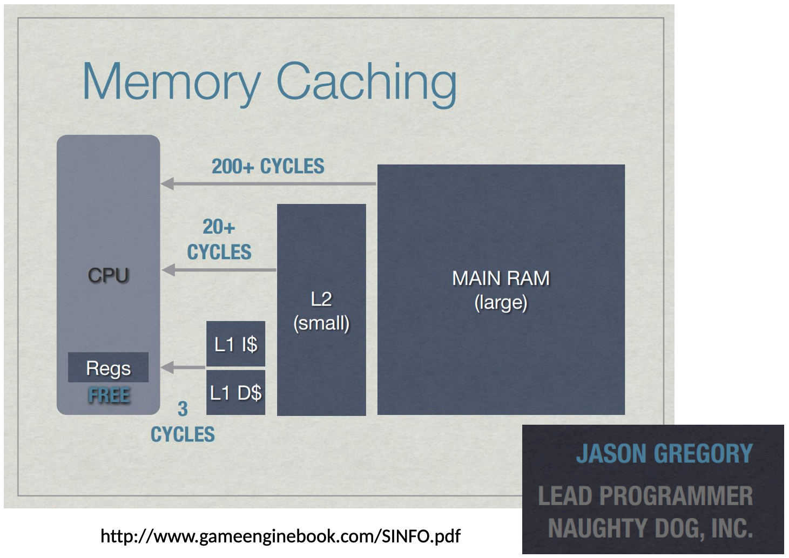

# Hardware

References:

1. [Andrew Kelley Practical Data Oriented Design](https://www.youtube.com/watch?v=IroPQ150F6c)
1. [ECS and Data Oriented Design - Mathieu Ropert - code::dive 2023](https://www.youtube.com/watch?v=McZvt1hZ7SI)
