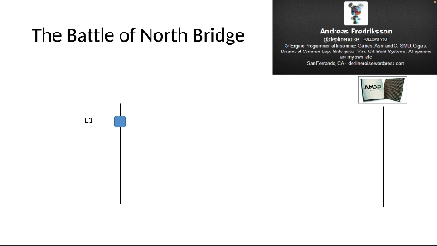

# Why Should I Care?

As of today(Oct 10, 2024), I don't write code with performance in my mind.
Well, nobody taught me to think about performance.

> I am NOT talking performance in terms of asymptotic analysis(`O(n)`), but it
> terms of how the program is executed on the hardware. Any I utilising the
> hardware capabilities to make the program exection fast?

Subconsciously, I have been believing that modern hardware is so fast that I
can afford to write non-performant programs and things will work fine. 

I was wrong! I was SO wrong! 😢

Recently, I have seen some talks by [Casey Muratori](https://caseymuratori.com/about) 
(his [X handle](https://x.com/cmuratori])), who is a game engine dev. He claims 
that *most of the modern software is bad!*. He shows on a stream that Visual
Studio Code editor has a terrible debugger, compares it with another debugger 
who was made by a single person as a side project.

Another demo was about the Windows terminal. Over 2 days we was able to make a 
terminal who is way faster than the Windows terminal.

In another video, that went viral too, he quantitively showed that OOP principles
slows down a program by order of magnitudes(10x). These optimisations do NOT 
need any fancy techniques. Simple knowledge about how prgrams are actually 
executed on a CPU can enable you to make them faster.

> This is eye opening to me. 🤯

May be as a web dev I can learn such simple techniques to write efficient 
programs that reduce response times and increase throughput! Efficient progrms 
will also need less infrastructure, hence saving infra costs directly.

Lets call this knowledge `Performance Aware Computing` or `PAC`. (This term is 
used by Casey Muratori in his online course.)

PAC is MORE about writing the code in an optimal way to get *more from the 
hardware*.

> Can you write a matrix multiplication program that can take advantage of the 
> multiple cores present in our laptop? I can't!

> Do you know that in most modern computers inserting an element in an array
> will be much faster than inserting an element in a linked list? 

> Do you think about cache misses or about data in L1, L2, L3 caches its 
> lifetime to get faster execution.

> Do you think about whether your program is IO bound or CPU bound?

Look at the speed difference in data access below. Why would you not want to 
take advantage of it!

!!! note
    I am conviced that even as a web dev I need to understand software performance.

*But how?*

First of all, study Casey's course [Performance-Aware Programming Series](https://www.computerenhance.com/p/table-of-contents)

Another is reading and adopting Data Oriented Design.

A good mental model that can help in writing performant code is **Thinking about 
Data First and How it is Transformed**. This is the old way of doing things. It 
nowadays also called **Data Oriented Design* (DoD).

This is Mike Action explaining the principles of DoD. 
[CppCon 2014: Mike Acton "Data-Oriented Design and C++"](https://www.youtube.com/watch?v=rX0ItVEVjHc)

Basically, OOP vs DoD will look like this

1. // TODO
1. 

!!! note
    DoD or OOP are different ways to looking at real world problems and then defining
    them into code. They are tools. As programmers we should understand there 
    advantages and cost.

Resources:

1. [CppCon 2014: Mike Acton "Data-Oriented Design and C++"](https://www.youtube.com/watch?v=rX0ItVEVjHc)
1. [CppCon 2018: Stoyan Nikolov “OOP Is Dead, Long Live Data-oriented Design”](https://www.youtube.com/watch?v=yy8jQgmhbAU)
1. https://medium.com/@jacobfriedman/object-oriented-programming-is-an-expensive-disaster-which-must-end-2cbf3ea4f89d
1. [Discussing Roc and functional systems with Richard Feldman](https://www.youtube.com/watch?v=LC1yxlicWUs)
